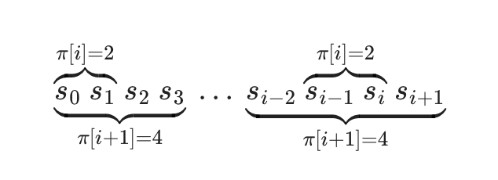
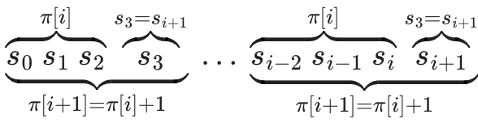
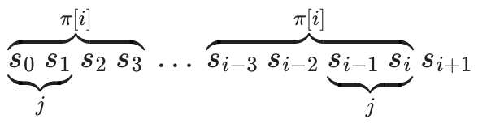
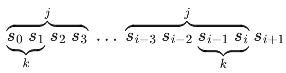

# Funcția Prefix. Algoritmul Knuth-Morris-Pratt

## Definiția funcției prefix

Fie dat un șir \\(s\\) de lungime \\(n\\).
**Funcția prefix** pentru acest șir este definită ca un vector \\(\pi\\) de lungime \\(n\\), unde \\(\pi[i]\\) reprezintă lungimea celui mai lung prefix propriu al subșirului \\(s[0 \dots i]\\) care este și sufix al acestui subșir.
Un prefix propriu al unui șir este un prefix care nu este egal cu șirul însuși.
Prin definiție, \\(\pi[0] = 0\\).

Matematic, definiția funcției prefix poate fi scrisă astfel:

$$\pi[i] = \max_ {k = 0 \dots i} \{k : s[0 \dots k-1] = s[i-(k-1) \dots i] \}$$

De exemplu, funcția prefix pentru șirul "abcabcd" este \\([0, 0, 0, 1, 2, 3, 0]\\), iar pentru șirul "aabaaab" este \\([0, 1, 0, 1, 2, 2, 3]\\).

## Algoritm Trivial

Un algoritm care urmează exact definiția funcției prefix este următorul:

```cpp
vector<int> prefix_function(string s) {
    int n = (int)s.length();
    vector<int> pi(n);
    for (int i = 0; i < n; i++)
        for (int k = 0; k <= i; k++)
            if (s.substr(0, k) == s.substr(i-k+1, k))
                pi[i] = k;
    return pi;
}
```

Este ușor de observat că complexitatea sa este \\(O(n^3)\\), care poate fi îmbunătățită.

### Prima optimizare

Prima observație importantă este că valorile funcției prefix pot crește cu cel mult unu.

Într-adevăr, altfel, dacă \\(\pi[i + 1] \gt \pi[i] + 1\\), atunci putem lua acest sufix care se termină în poziția \\(i + 1\\) cu lungimea \\(\pi[i + 1]\\) și să eliminăm ultimul caracter din el.
Ajungem la un sufix care se termină în poziția \\(i\\) cu lungimea \\(\pi[i + 1] - 1\\), care este mai bun decât \\(\pi[i]\\), adică obținem o contradicție.

Următoarea ilustrație arată această contradicție.
Cel mai lung sufix propriu la poziția \\(i\\) care este și prefix are lungimea \\(2\\), iar la poziția \\(i+1\\) are lungimea \\(4\\).
Prin urmare, șirul \\(s_0 ~ s_1 ~ s_2 ~ s_3\\) este egal cu șirul \\(s\_{i-2} ~ s\_{i-1} ~ s_i ~ s\_{i+1}\\), ceea ce înseamnă că și șirurile \\(s_0 ~ s_1 ~ s_2\\) și \\(s\_{i-2} ~ s\_{i-1} ~ s_i\\) sunt egale, deci \\(\pi[i]\\) trebuie să fie \\(3\\).



Astfel, atunci când trecem la poziția următoare, valoarea funcției prefix poate fie să crească cu unu, să rămână aceeași sau să scadă cu o anumită valoare. Acest fapt ne permite deja să reducem complexitatea algoritmului la \\(O(n^2)\\), deoarece, într-un singur pas, funcția prefix poate crește cu cel mult unu. În total, funcția poate crește cu cel mult \\(n\\) pași și, prin urmare, poate scădea, de asemenea, cu cel mult \\(n\\) pași. Aceasta înseamnă că trebuie să efectuăm doar \\(O(n)\\) comparații de șiruri, ceea ce duce la o complexitate finală de \\(O(n^2)\\).

### A doua optimizare

Să mergem mai departe, vrem să scăpăm de comparațiile de șiruri.
Pentru a realiza acest lucru, trebuie să folosim ce am calculat în pașii anteriori.

Să calculăm valoarea funcției prefix \\(\pi\\) pentru \\(i + 1\\).
Dacă \\(s[i+1] = s[\pi[i]]\\), atunci putem spune cu certitudine că \\(\pi[i+1] = \pi[i] + 1\\), deoarece știm deja că sufixul de la poziția \\(i\\) de lungime \\(\pi[i]\\) este egal cu prefixul de lungime \\(\pi[i]\\).



### Traducerea textului:

Dacă acesta nu este cazul, adică \( s[i + 1] \neq s[\pi[i]] \), atunci trebuie să încercăm un șir mai scurt. Pentru a accelera procesul, ne dorim să trecem imediat la cea mai mare lungime \( j < \pi[i] \), astfel încât proprietatea de prefix la poziția \( i \) să fie îndeplinită, adică: \\(s[0 \dots j - 1] = s[i - j + 1 \dots i]\\)



Dacă găsim o astfel de lungime \\( j \\), atunci trebuie doar să comparăm caracterele \\( s[i + 1] \\) și \\( s[j] \\). Dacă sunt egale, putem atribui \\( \pi[i + 1] = j + 1 \\). În caz contrar, trebuie să găsim cea mai mare valoare mai mică decât \\( j \\) pentru care proprietatea de prefix este îndeplinită și să continuăm acest proces. Se poate întâmpla ca acest lucru să continue până când \\( j = 0 \\). Dacă în final \\( s[i + 1] = s[0] \\), atunci atribuim \\( \pi[i + 1] = 1 \\), iar dacă nu, \\( \pi[i + 1] = 0 \\).

Astfel, avem deja schema generală a algoritmului. Singura întrebare rămasă este **cum găsim eficient valorile pentru \\( j \\)**.

Să recapitulăm: pentru lungimea curentă \\( j \\) la poziția \\( i \\), pentru care proprietatea de prefix este îndeplinită, adică: \\(s[0 \dots j - 1] = s[i - j + 1 \dots i]\\) dorim să găsim cel mai mare \\( k < j \\), pentru care proprietatea de prefix este îndeplinită.



Ilustrația arată că această valoare trebuie să fie \\( \pi[j - 1] \\), pe care am calculat-o deja anterior.

### Implementare finală

### Traducerea textului:

Astfel, putem în sfârșit construi un algoritm care nu efectuează nicio comparație directă de șiruri și realizează doar **\( O(n) \)** operațiuni.

#### Procedura finală:

- Calculăm valorile funcției prefix \\( \pi[i] \\) într-o buclă, iterând de la \\( i = 1 \\) până la \\( i = n - 1 \\) (\\( \pi[0] \\) este atribuit direct cu 0).
- Pentru a calcula valoarea curentă \\( \pi[i] \\), definim variabila \\( j \\), care reprezintă lungimea celui mai bun sufix pentru \\( i - 1 \\). Inițial, \\( j = \pi[i - 1] \\).

- Verificăm dacă sufixul de lungime \\( j + 1 \\) este și prefix, comparând caracterele \\( s[j] \\) și \\( s[i] \\).

  - Dacă sunt egale, atunci atribuim \\( \pi[i] = j + 1 \\).
  - Altfel, reducem \\( j \\) la \\( \pi[j - 1] \\) și repetăm acest pas.

- Dacă ajungem la \\( j = 0 \\) și încă nu avem o potrivire, atribuim \\( \pi[i] = 0 \\) și trecem la indexul \\( i + 1 \\).

Implementarea este surprinzător de scurtă și expresivă:

```cpp
vector<int> prefix_function(string s) {
    int n = (int)s.length();
    vector<int> pi(n);
    for (int i = 1; i < n; i++) {
        int j = pi[i-1];
        while (j > 0 && s[i] != s[j])
            j = pi[j-1];
        if (s[i] == s[j])
            j++;
        pi[i] = j;
    }
    return pi;
}
```

Acesta este un algoritm **online**, adică procesează datele pe măsură ce sosesc - de exemplu, puteți citi caracterele șirului unul câte unul și le puteți procesa imediat, găsind valoarea funcției prefix pentru fiecare caracter următor.

## Aplicații

### Căutarea unui subșir într-un șir. Algoritmul Knuth-Morris-Pratt

Aceasta este aplicația clasică a funcției prefix.

Dat un text \\(t\\) și un șir \\(s\\), vrem să găsim și să afișăm pozițiile tuturor aparițiilor șirului \\(s\\) în textul \\(t\\).

Pentru comoditate notăm cu \\(n\\) lungimea șirului \\(s\\) și cu \\(m\\) lungimea textului \\(t\\).

Generăm șirul \\(s + \# + t\\), unde \\(\#\\) este un separator care nu apare nici în \\(s\\), nici în \\(t\\).
Calculăm funcția prefix pentru acest șir.
Dacă la o poziție \\(i\\) avem \\(\pi[i] = n\\), atunci la poziția \\(i - 2n\\) în șirul \\(t\\) apare șirul \\(s\\). Complexitatea acestui algoritm este \\(O(n + m)\\).
